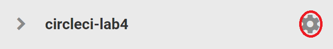

# Lab 4 CircleCI

In this lab we'll get up and running with CircleCI by running through their "Hello World" Tutoral.
You'll need your AWS :cloud: and GitHub :octocat: credentials as we'll be deploying Packer images through CircleCI

1. Go to the CircleCI and sign up for a [free account](https://circleci.com/signup/)
I recommend signing up using your GitHub account as it links everything up

2. Run through the CircleCI [Getting Started Introduction](https://circleci.com/docs/2.0/getting-started) and complete up to the section titled [**Using the Workflows Functionality**](https://circleci.com/docs/2.0/getting-started/#using-the-workflows-functionality), we will create our own workflow to show how we can trigger Packer builds automatically with Git and CircleCI


### Lab part 2
Now we are going to create a very simple workflow to run a Packer validate and build, and create the image on AWS

1. Create a new GitHub repository called *circleci-lab4*
2. Clone the repository to your laptop
3. Go into the *circleci-lab4* and create two directories *.circleci* and *packer*
4. Copy the file from the *pp_iac_labs/packer/lab1/lab1.json* into *cirecle-ci/packer/build.json* directory
5. Copy the *config.yml* file from *pp_iac_labs/circleci/lab4* to *.circleci*
6. Use git to update the remote repository

```bash
git add .
git commit -m "my 1st circleci build"
git push origin
```
7. Go to CircleCI console and set up the project from the add projects meu item on the left panel and click on   
   
8. You will need to enter your AWS credentials into CircleCI. Go to the jobs menu and select the settings

9. Enter your AWS permissions and also set an Environment Variable for the *AWS_DEFAULT_REGION* to *ap-southeast-2*
10. You should now be able to run the job and make sure it completes sucessfully.
11. Check in the AWS console and check Instance, Snap and AMI completes as you would expect.
12. Now try git branching
```bash
git checkout -b mytest
git push origin mytest
```
Notice that this automatically kickoffs another job in CircleCI
13. If time permits, complete the CircleCI tutorial started in step 2
# End of Lab 4
